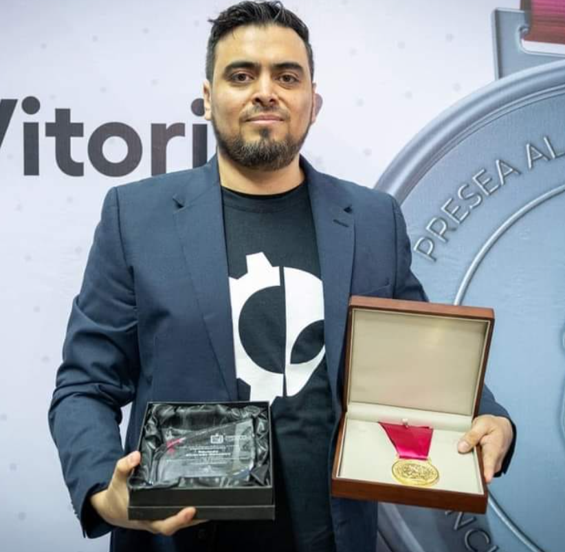
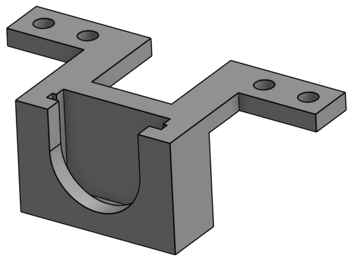
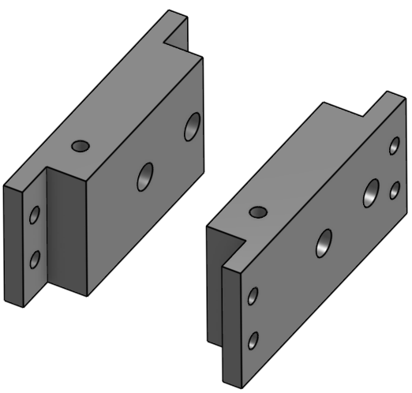
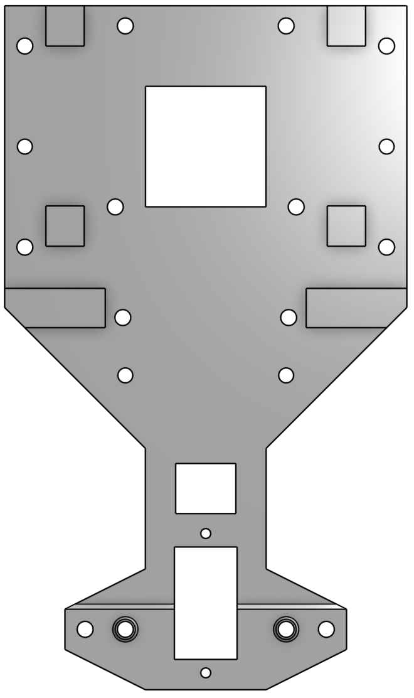
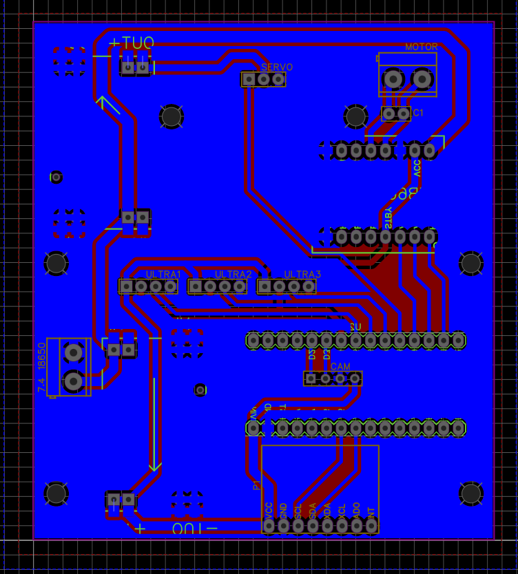

# 🤖 WRO-2026-Future-Engineers — Los Grises Superiores

Official repository of **Team Los Grises Superiores** for the **Future Engineers – World Robot Olympiad 2026**.

> **Season theme:** Autonomous Self-Driving Cars — Open Championship Online  
> **Category:** Future Engineers | **Age group:** 14–22

<div align="center">

</div>

---

## 📸 Team Photo

<div align="center">
  
</div>

---

## 👥 Team Members

<table align="center">
  <tr>
    <th colspan="2" align="left">
      👨‍🏫 Eduardo Alvarado González — Coach & Founder
    </th>
  </tr>
  <tr>
    <td width="260">
      
    </td>
    <td>
      <b>Age:</b> 40<br><br>
      An engineer and professor who founded <b>Los Grises Superiores</b> in 2014. Under his leadership, the team has achieved outstanding results at national and international level in WRO and the Mexican Robotics Tournament (TMR).
    </td>
  </tr>
</table>

---

<table align="center">
  <tr>
    <th colspan="2" align="left">
      💻 Christopher Pérez Cortés — Programming & Electronics
    </th>
  </tr>
  <tr>
    <td width="260">
      
    </td>
    <td>
      <b>Age:</b> 14<br><br>
      Christopher joined the <b>Robotics Club</b> at Escuela Normal Superior "Profr. Moisés Sáenz Garza" earlier this year after completing an intensive robotics course. Currently in his third year of middle school, he has quickly developed skills in <b>electronics, programming (Arduino C++), and 3D modeling (Onshape)</b>. WRO 2026 is his first international competition.
    </td>
  </tr>
</table>

---
<table align="center">
  <tr>
    <th colspan="2" align="left">
      🔧 Bárbara Daiana García Balboa — Design & Assembly
    </th>
  </tr>
  <tr>
    <td width="260">
      
    </td>
    <td>
      <b>Age:</b> 13<br><br>
      Bárbara joined the robotics club two months ago after completing two intensive robotics courses. She is responsible for <b>mechanical design, chassis assembly, and structural testing</b>. WRO 2026 is her first competition.
    </td>
  </tr>
</table>

---
<table align="center">
  <tr>
    <th colspan="2" align="left">
      🛠️ Paulina Ibarra Martínez — Design & Construction
    </th>
  </tr>
  <tr>
    <td width="260">
      
    </td>
    <td>
      <b>Age:</b> 21<br><br>
      Paulina brings extensive competition experience to the team. She has participated in <b>two Mexican Robotics Tournaments</b> (5th place) and served as junior coach in WRO 2024 (3rd place) and TMR 2025 (1st place nationally). Her role this season focuses on <b>structural design, component integration, and mentoring the younger members</b>.
    </td>
  </tr>
</table>

---

## 📚 Table of Contents

- [Project Overview & Abstract](#project-overview--abstract)
- [Vehicle Photos](#vehicle-photos)
- [Project Videos](#-project-videos)
- [Criterion 1 — Mobility & Mechanical Design](#criterion-1--mobility--mechanical-design)
  - [Chassis Design & Iteration](#chassis-design--iteration)
  - [Structural Components (3D Design)](#-structural-components-3d-design)
  - [Steering System](#steering-system)
  - [Traction System](#traction-system)
  - [Mechanical Trade-offs & Decisions](#mechanical-trade-offs--decisions)
- [Criterion 2 — Power & Sensor Architecture](#criterion-2--power--sensor-architecture)
  - [Power System & Budget](#power-system--budget)
  - [Wiring Diagram & PCB](#wiring-diagram)
  - [Sensor Selection & Placement](#sensor-selection--placement)
  - [Calibration Methods](#calibration-methods)
- [Criterion 3 — Software Architecture & Obstacle Strategy](#criterion-3--software-architecture--obstacle-strategy)
  - [System Overview](#system-overview)
  - [State Machine](#state-machine)
  - [Open Challenge Algorithm](#open-challenge-algorithm)
  - [Obstacle Challenge Algorithm](#obstacle-challenge-algorithm)
  - [Vision Processing Strategy (ROIs)](#-vision-processing-strategy-rois)
  - [Parking Strategy](#️-parking-strategy)
  - [PID Control Implementation](#pid-control-implementation)
  - [Testing & Tuning Process](#testing--tuning-process)
- [Criterion 4 — Systemic Thinking & Engineering Decisions](#criterion-4--systemic-thinking--engineering-decisions)
  - [Evolution from 2025 to 2026](#evolution-from-2025-to-2026)
  - [Constraints & Trade-offs](#constraints--trade-offs)
  - [Risk Analysis & Mitigation](#risk-analysis--mitigation)
- [Criterion 5 — Repository & Reproducibility](#criterion-5--repository--reproducibility)
  - [Repository Structure](#repository-structure)
  - [How to Build & Run](#how-to-build--run)
  - [Components & Bill of Materials](#components--bill-of-materials)
- [References](#references)

---

## Project Overview & Abstract

We present the **development and implementation of an autonomous vehicle** designed for the **World Robot Olympiad 2026 – Future Engineers** category. This robot is the direct evolution of our 2025 competition vehicle — which reached the international final — rebuilt from the ground up with a **fully 3D-printed chassis**, a new **HuskyLens AI camera**, and a refined **Arduino Nano-based control architecture**.

The **Future Engineers** category requires a self-driving car to complete two challenges autonomously:

1. **Open Challenge** — Complete **3 laps** on a track whose inner wall distance (600 mm or 1000 mm), starting position, and driving direction (CW/CCW) are randomized each run.
2. **Obstacle Challenge** — Complete **3 laps** reacting to colored traffic pillars (red → pass right, green → pass left), then perform a **parallel parking maneuver** inside a magenta-delimited bay (fixed width: 20 cm, length: 1.5× robot length).

**Key 2026 rule changes we addressed in our design:**
- Variable inner corridor width (600 mm or 1000 mm) → requires adaptive speed logic
- Parking bonus points only awarded if at least one full lap is completed (WRO 2026 rule 8 & 10)
- Surprise rule may apply at the international final (WRO 2026 rule 6)
- New documentation rubric with 5 engineering criteria (30 points total, Appendix C)

Documentation (this repository) accounts for **~25% of the total score (30/122 points)**.

---

## Vehicle Photos

<div align="center">

| Front | Back |
|:--:|:--:|
|  |  |

| Top | Bottom |
|:--:|:--:|
|  |  |

| Left | Right |
|:--:|:--:|
|  |  |

</div>

> 📁 Full-resolution photos available in the [`v-photos/`](./v-photos/) folder.

---

## 🎥 Project Videos

<div align="center">

### 🧩 Open Challenge
[](LINK_OPEN_CHALLENGE_2026)

### 🚧 Obstacle Challenge
[](LINK_OBSTACLE_CHALLENGE_2026)

</div>

> Each video shows the vehicle operating autonomously for at least 30 seconds, as required by the WRO 2026 rules (Section 7).

---

---

## Criterion 1 — Mobility & Mechanical Design

### Chassis Design & Iteration

The 2025 robot used a **LEGO Mindstorms EV3** chassis — modular and quick to assemble but heavy (~1.2 kg with electronics), limited in geometry flexibility, and constrained by the EV3 brick's processing power for real-time vision.

For 2026 we migrated to a **fully custom 3D-printed chassis** designed in **Onshape**. The key design requirements were:

| Requirement | Rationale |
|---|---|
| Max dimensions: 300 × 200 × 300 mm | WRO rule 9.17 |
| Max weight: 1.5 kg | WRO rule 11.2 |
| Ackermann-style front steering | Rules prohibit differential drive (11.3, 11.5) |
| Rear-wheel drive via DC motor | Single drive motor simplifies wiring and control |
| Open front bay for ultrasonic sensors | Field-of-view requirement for wall detection |

**Iteration history:**
- **Version 1 (February 2026):** Initial flat-plate chassis. Problem: insufficient rigidity when servo torque was applied; steering linkage deflected under load.
- **Version 2 (March 2026):** Added triangular gussets at servo mount and increased wall thickness from 2 mm to 3 mm. Weight increased by ~40 g but deflection was eliminated.
- **Version 3 (April 2026, current):** Reduced overall length by 18 mm to improve cornering clearance in the narrow 600 mm corridor; relocated the Arduino Nano to a lower center of gravity position.

<div align="center">


*Fig. 1 — Onshape CAD render of Version 3 chassis*
</div>

The mechanical design of the robot was developed through multiple iterations, focusing on improving structural rigidity, component integration, and maneuverability.
---
#### 🔹 Structural Components (3D Design)

<div align="center">

| Central Sensor Mount | Side Sensor Mounts | Rear Support |
|:--:|:--:|:--:|
|  |  |  |

| External Supports | Internal Supports | Directional Module |
|:--:|:--:|:--:|
|  |  |  |

| Lower Body | Upper Body | Full Base Structure |
|:--:|:--:|:--:|
|  |  |  |

</div>

---

#### 🔹 Main Chassis Structure

<div align="center">

| Lower Body | Upper Body |
|:--:|:--:|
|  |  |

</div>
---
#### 🔹 Complete Assembly

<div align="center">

| Full Base Structure |
|:--:|
|  |

</div>

---

#### 🔹 Steering Component

<div align="center">

| Directional Module |
|:--:|
|  |

</div>
---

### Steering System

The front axle uses an **Ackermann steering geometry** implemented through a servo-actuated rack-and-pinion linkage. The LEGO Technic rack (part 64781) is integrated into the 3D-printed front module, giving precise and repeatable steering response.

| Parameter | Value |
|---|---|
| Steering servo | SG90 (9g, 1.8 kg·cm stall torque) |
| Steering range | ~30° left / 30° right from center |
| Center pulse width | 1500 µs |
| Left limit | `IZQUIERDA = 45` (1100 µs) |
| Right limit | `DERECHA = 135` (1900 µs) |
| Control resolution | 1° via Arduino `Servo.write()` |

**Why Ackermann geometry?** In a standard turn, the inner and outer front wheels trace arcs of different radii. Without Ackermann compensation, the inner wheel scrubs against the surface, reducing precision and creating steering resistance. Our tie-rod linkage achieves approximately 70% Ackermann correction — sufficient for the minimum track radii encountered in WRO (estimated ~300 mm inner radius at corners).

**Trade-off:** A full Ackermann trapezoid would require a wider front axle, risking an exceedance of the 200 mm width limit (rule 9.17). We accepted the 30% geometric compromise in exchange for rule compliance and simpler fabrication.

---

### Traction System

| Parameter | Value |
|---|---|
| Drive motor | DC motor with gearbox (included in RC chassis base) |
| Driver IC | TB6612FNG dual H-bridge |
| Drive wheels | Rear axle, both wheels connected via gear train (not independent) |
| Gear ratio | Approx. 1:30 (estimated from encoder counts vs. measured distance) |

**Speed range tested:**

| PWM value | Measured speed | Use case |
|---|---|---|
| 110 | ~0.28 m/s | Narrow corridor / front obstacle |
| 130 | ~0.36 m/s | Normal straight section |
| 150 | ~0.44 m/s | Wide open corridor |

We tested 1:20 and 1:50 gear options. At 1:20 the robot was too fast to react to pillars within the sensor latency budget. At 1:50 acceleration was too slow to complete 3 laps within the 3-minute time limit. We chose 1:30 as the best trade-off between speed and control responsiveness.

> ⚠️ WRO rule 11.5 prohibits electronic differential (one motor per side). Our rear axle connects both wheels to a single motor through the gear train, fully compliant.

---

### Mechanical Trade-offs & Decisions

| Decision | Option A (chosen) | Option B (rejected) | Reason |
|---|---|---|---|
| Chassis material | 3D-printed PLA | LEGO Technic | Custom geometry, lower weight |
| Steering | Servo + rack | Differential steering | Rules require ackermann-type steering |
| Drive | Single DC motor | Two motors (coupled) | Simpler, lighter, compliant with 11.5 |
| Camera position | Front-center, tilted 20° down | Side-mounted | Better field of view for pillar detection and wall proximity |

---

## Criterion 2 — Power & Sensor Architecture

### Power System & Budget

The robot uses **two separate power rails** to isolate motor noise from the control electronics:

| Rail | Source | Consumers | Estimated current |
|---|---|---|---|
| 5 V logic | 7.4 V LiPo → Mini 560 step-down (5 V / 3 A) | Arduino Nano, MPU6050, HuskyLens, HC-SR04 ×3 | ~800 mA peak (measured under full sensor load) |
| Motor rail | 7.4 V LiPo (direct) | TB6612FNG + DC motor | ~1.5 A peak |

**Power budget analysis:**

| Component | Typical current (mA) |
|---|---|
| Arduino Nano | 20 |
| MPU6050 | 3.9 |
| HuskyLens | 320 (active AI) |
| HC-SR04 ×3 | 45 (15 mA each) |
| SG90 servo (active) | 250 |
| **Total logic rail** | **~640 mA** |
| DC motor (avg.) | 800–1500 |
| **Total motor rail** | **~1500 mA** |

The Mini 560 step-down is rated at 3 A continuous; our logic rail draws ~640 mA, giving a **safety margin of ~4.7×**. This margin accounts for HuskyLens inference spikes and servo stall.

**Failure mode considered:** If the LiPo voltage drops below ~6.5 V, the Mini 560 drops out of regulation. We added a **mini digital voltmeter** visible on the chassis to monitor battery state before each run.

---

### Wiring Diagram

> 📁 Full wiring schematic (PDF and PNG) available in [`schemes/`](./schemes/).

**Connection summary:**

```
LiPo (7.4 V)
    ├── Mini 560 Step-Down → 5 V rail
    │       ├── Arduino Nano (5 V pin)
    │       ├── MPU6050 (I2C: SDA→A4, SCL→A5)
    │       ├── HuskyLens (I2C: SDA→A4, SCL→A5)
    │       └── HC-SR04 ×3
    │               Front  TRIG→D7  ECHO→D6
    │               Left   TRIG→D3  ECHO→D2
    │               Right  TRIG→D5  ECHO→D4
    └── TB6612FNG (VMOT = 7.4 V)
            ├── DC Motor (rear axle)
            │       AIN1→D10  AIN2→D11  PWMA→D9
            └── SG90 Servo (signal→D8)
```

**I2C bus:** Both the MPU6050 and HuskyLens share the I2C bus (address 0x60 for HuskyLens, 0x68 for MPU6050). No address conflict exists.

---
### 🔌 PCB & Wiring Implementation

<div align="center">

| PCB Design | PCB Schematic |
|:--:|:--:|
|  |  |

</div>
---

### 🧠 Engineering Insight

The PCB was designed to centralize all electrical connections and reduce wiring complexity inside the chassis.

Compared to direct wiring, this approach improved:

- Electrical reliability during motion  
- Faster debugging and maintenance  
- Reduced cable clutter and connection errors  

This was especially important due to the compact size of the robot and the need for stable sensor readings.
### Sensor Selection & Placement

#### HC-SR04 Ultrasonic Sensors (×3)

| Sensor | Position | Purpose |
|---|---|---|
| Front | Center front, horizontal | Detect wall / corner ahead |
| Left | Left side, horizontal | Measure distance to inner/outer wall |
| Right | Right side, horizontal | Measure distance to inner/outer wall |

**Why ultrasonic over IR?** The WRO field uses matte black walls. IR reflectance sensors give unreliable readings on dark surfaces; ultrasonic sensors are color-independent.

**Placement rationale:** Sensors are mounted at wheel axle height (~50 mm from ground) to avoid sensing the floor in curved sections where the robot tilts slightly.

**Known limitation:** HC-SR04 has a minimum sensing distance of ~2 cm and a cone angle of ~15°. At high speeds, multiple echo returns can cause occasional spikes. We implemented a moving-average filter in software (see Criterion 3).

#### MPU6050 IMU (6-DOF)

Used exclusively for **yaw (rotation) tracking**. The gyroscope integrates angular velocity to give heading. We use accumulated yaw to:
1. Count 90° turns (each corner = 1 turn, 4 turns = 1 lap)
2. Detect and correct drift in straight sections
3. Determine lap count (3 laps = 1080° accumulated yaw)

**Calibration:** On startup, `mpu.calcOffsets(true, true)` is called with the robot stationary for ~3 seconds to compute gyro bias. The robot must not be moved during this window — indicated by the serial monitor message `"Calibrando IMU... No mover el robot."`.

#### HuskyLens AI Camera (SEN0305)

| Parameter | Value |
|---|---|
| Resolution | 320 × 240 px |
| Interface | I2C (up to 400 kHz) |
| Mode used | Color Recognition |
| Trained objects | ID 1 = Red pillar, ID 2 = Green pillar |
| Frame rate | ~30 FPS (hardware AI, no host processing) |
| Mounting | Front-center, tilted 20° downward |

**Why HuskyLens instead of OpenMV (2025)?** The OpenMV H7 Plus required Python scripting and UART communication with EV3, introducing ~50 ms latency per frame. HuskyLens runs inference on-chip and returns block coordinates via I2C in <10 ms. This 5× latency reduction is critical at our operating speeds.

**Trade-off:** HuskyLens requires manual training on the physical pillars under competition lighting. We performed 3 training sessions (lab, outdoor, gym) and selected the model with the best generalization. The camera angle of 20° was chosen empirically: 0° caused false detections of the floor line; 30° reduced detection range to <40 cm.

---

### Calibration Methods

| Sensor | Calibration method | When |
|---|---|---|
| MPU6050 | Static bias computation (`calcOffsets`) | At power-on, before start button |
| HuskyLens | On-device training with 20 samples per color | Before competition, stored in camera flash |
| HC-SR04 | Measured against known distances (10, 20, 50 cm ruler) | Manual verification; no runtime calibration needed |
| Servo center | Adjusted `CENTRO` constant to achieve mechanically straight driving | One-time setup per robot rebuild |

---

## Criterion 3 — Software Architecture & Obstacle Strategy

### System Overview

The entire control system runs on a **single Arduino Nano (ATmega328P, 16 MHz)**. There is no separate SBC; all sensor reading, decision logic, and motor control happen in the same `loop()` cycle, which executes in approximately **25 ms** (40 Hz update rate).

**Software modules:**

| Module | Functions | Description |
|---|---|---|
| `IMU` | `actualizarIMU()`, `actualizarConteoGiros()`, `giroRelativo()` | Reads MPU6050, integrates yaw, counts 90° turns |
| `Ultrasonics` | `medirDistancia(TRIG, ECHO)` | Returns distance in cm via HC-SR04 pulse timing |
| `PID` | Inline in `loop()` | Lateral wall-following with gyro correction |
| `HuskyLens` | `huskylens.request()`, `huskylens.read()` | Queries camera for color block detections |
| `Drive` | `avanzar(speed)`, `detener()`, `girarSuave()` | Controls TB6612FNG and SG90 servo |
| `Start Sequence` | `faseInicio` state machine | 3-phase startup alignment |

---

### State Machine

```
┌─────────────────────────────────────────────────────────────────┐
│                      SYSTEM STATES                              │
├──────────────┬──────────────────────────────────────────────────┤
│ INICIO       │ 3-phase startup alignment (wall centering)       │
│   Phase 0    │   Front wall detected → escape turn              │
│   Phase 1    │   Anti-corner S-maneuver                         │
│   Phase 2    │   Fine centering with ultrasonics                │
├──────────────┼──────────────────────────────────────────────────┤
│ LANE_FOLLOW  │ PID lateral + IMU gyro correction                │
│              │ Adaptive speed (110/130/150 PWM)                 │
├──────────────┼──────────────────────────────────────────────────┤
│ AVOID_COLOR  │ HuskyLens detects pillar →                       │
│              │   ID1 (red)  → steer RIGHT (DERECHA)             │
│              │   ID2 (green)→ steer LEFT (IZQUIERDA)            │
│              │ Returns to LANE_FOLLOW after 300 ms              │
├──────────────┼──────────────────────────────────────────────────┤
│ EMERGENCY    │ distL < 7 cm  → hard right                       │
│              │ distR < 7 cm  → hard left                        │
│              │ distF < 15 cm → turn toward open side            │
├──────────────┼──────────────────────────────────────────────────┤
│ STOP         │ yawAcumulado ≥ 1080° → detener() + while(1)      │
└──────────────┴──────────────────────────────────────────────────┘
```

**State transitions are priority-ordered:** STOP > EMERGENCY > AVOID_COLOR > LANE_FOLLOW > INICIO.

---

### Open Challenge Algorithm

```
SETUP:
  Initialize I2C (MPU6050 + HuskyLens)
  Calibrate IMU (calcOffsets)
  Reset yawAcumulado = 0, girosContados = 0
  Wait for Start button

LOOP (every 25 ms):
  1. actualizarIMU()          ← integrate gyro, detect 90° threshold
  2. actualizarConteoGiros()  ← increment girosContados, accumulate yaw
  3. IF yawAcumulado >= 1080° → STOP (3 laps done)
  4. Read distF, distL, distR from HC-SR04
  5. IF inicio: run 3-phase alignment, RETURN
  6. Compute pasilloEstrecho (distL<15 AND distR<15)
  7. Set velocidad: distF<18→110, distF<30→130, else→150
  8. Compute PID (distL - distR error, with exponential smoothing)
  9. Apply IMU correction (giroRelativo() on straight sections)
  10. Check EMERGENCY overrides
  11. Check HuskyLens color detection (NOT in emergency)
  12. girarSuave() + avanzar(velocidad)
```

**Lap counting method:** The MPU6050 accumulates yaw. Each 90° crossing (with a hysteresis threshold of ±5°) increments `girosContados`. After 12 increments (3 laps × 4 corners), `yawAcumulado` reaches 1080° and the robot stops. This method is **direction-agnostic** — it works for both CW and CCW because the magnitude of yaw is accumulated, not the sign.

---

### Obstacle Challenge Algorithm

The obstacle challenge extends the open challenge with:

1. **Color detection:** HuskyLens in Color Recognition mode. When a block is detected, the largest block by area is selected (multi-block priority logic).
2. **Avoidance maneuver:** Steer toward the correct side, hold for 300 ms (`tiempoColor`), then return to lane-follow. The 300 ms was determined empirically across 20 test runs to give consistent clearance without overshooting.
3. **Parking (Obstacle Challenge only):** After 3 laps, the robot locates and parks in the magenta bay using a combination of ultrasonic distance sensing and HuskyLens visual confirmation. The full parking sequence is documented in the [Parking Strategy](#️-parking-strategy) section below.

**Edge case handled:** If both left and right distances are < 15 cm (narrow corridor), `evitandoColor` is suppressed to avoid steering conflicts between the wall-following PID and the color avoidance.

---
## 👁️ Vision Processing Strategy (ROIs)

The vision system of the robot is based on the use of a HuskyLens AI camera operating in **Color Recognition mode**, trained to detect traffic pillars:
- **ID 1 → Red pillar**
- **ID 2 → Green pillar**

However, raw camera detection alone was not sufficient to achieve stable and reliable behavior. During initial testing, the robot experienced inconsistent detections caused by lighting variations, multiple objects in the frame, and noise from irrelevant areas.

### 🔍 Problem Identified

When processing the entire image:
- False detections occurred due to floor reflections
- Multiple objects caused conflicting decisions
- Detection latency increased due to unnecessary data processing
- The robot reacted late or incorrectly to obstacles

---

### 🧩 Solution: Regions of Interest (ROIs)

To improve performance, the image was divided into **Regions of Interest (ROIs)**, allowing the system to focus only on relevant areas.

Instead of analyzing the full frame, the robot prioritizes specific zones depending on the task.

---

### 🧱 ROI Structure

The image is conceptually divided into three functional zones:

#### 1. Upper ROI — Early Detection
- Detects distant pillars
- Allows anticipation of upcoming turns

**Function:**  
Prepare steering adjustments before reaching the obstacle

---

#### 2. Middle ROI — Decision Zone
- Detects pillars at actionable distance
- Main trigger for avoidance maneuvers

**Function:**  
Decide whether to turn left or right based on detected color

---

#### 3. Lower ROI — Stability & Filtering
- Filters out floor noise and irrelevant detections
- Helps prevent false positives

**Function:**  
Ensure that only valid objects are considered

---

### ⚙️ Detection Strategy

When multiple objects are detected:
- The system selects the **object with the largest area**
- This ensures the robot reacts to the closest and most relevant obstacle

Additionally:
- A **timing window (~300 ms)** is applied to prevent repeated triggers
- Detection is temporarily disabled during critical maneuvers (e.g., narrow corridor or emergency states)

---

### ⚠️ Trade-offs

| Decision | Advantage | Limitation |
|---------|----------|----------|
| Use of ROIs | Reduced noise and faster decisions | Requires manual tuning |
| Largest-area selection | Prioritizes closest object | May ignore smaller relevant objects |
| Single camera system | Simpler integration | No redundancy |

---

### ✅ Results

After implementing the ROI-based strategy:
- Detection became more stable under different lighting conditions
- False positives were significantly reduced
- Reaction time improved
- The robot achieved more consistent obstacle avoidance

---

### 🧠 Engineering Insight

The key improvement was not the sensor itself, but **how the information was processed**.

By limiting the data to relevant regions, the system became:
- more efficient
- more predictable
- easier to control

This approach demonstrates that performance gains can be achieved not only by adding hardware, but by improving **data interpretation and system design**.
---
### 🅿️ Parking Strategy

After completing the three required laps in the Obstacle Challenge, the robot must perform a **parallel parking maneuver** inside the designated magenta parking zone.

Although the final implementation is still under refinement, the parking system has been designed based on the following engineering approach:

---

### 🧩 Detection Strategy

The robot will use a combination of:
- **Ultrasonic sensors (HC-SR04)** to detect the parking space boundaries
- **Camera (HuskyLens)** to assist in identifying the parking area region if visual cues are available

The parking zone is expected to be detected based on:
- Increased lateral distance (gap between obstacles)
- Reduced frontal obstruction
- Optional visual confirmation (color or structure)

---

### ⚙️ Maneuver Plan

The parking maneuver is divided into three phases:

#### 1. Alignment Phase
- The robot positions itself parallel to the parking zone
- Uses PID control to maintain a stable distance from the wall

---

#### 2. Entry Phase
- The robot performs a controlled reverse or forward turning maneuver
- Steering angle is adjusted to follow a curved trajectory into the parking space

---

#### 3. Correction Phase
- Small forward/backward adjustments
- Uses ultrasonic feedback to center the robot within the space

---

### ⚠️ Challenges Identified

- Limited space relative to robot dimensions
- Sensor noise at close range (<10 cm)
- Need for precise timing and steering control

---

### 🔧 Planned Solutions

- Use reduced speed during parking (PWM < 110)
- Apply fixed-time steering sequences combined with sensor feedback
- Implement threshold-based stopping conditions using ultrasonic distances

---

### 🧠 Engineering Consideration

The parking system is designed to prioritize **repeatability over speed**, ensuring that the robot can consistently enter the parking zone even under slight variations in position after completing the laps.

This approach reflects a trade-off between complexity and reliability, focusing on a robust maneuver rather than a highly optimized but fragile solution.

---

### 🔁 Future Work

The final implementation will integrate:
- Real-time feedback loops for dynamic correction
- Improved detection of the parking zone boundaries
- Fine-tuning of timing and steering parameters

These updates will be committed to the repository before the final competition submission.

---

### PID Control Implementation

The lateral wall-following PID uses the **difference between left and right ultrasonic distances** as the error signal:

```
error = distL - distR
```

A positive error (robot closer to right wall) produces a positive PID output, steering left to re-center.

**Exponential smoothing (low-pass filter):**
```cpp
suavizado = (suavizado * 0.7f) + (error * 0.3f);
error     = suavizado;
```
This reduces HC-SR04 noise spikes from affecting the steering output.

**IMU gyro correction (straight sections only):**
```cpp
if (!enGiro) {
  float giro = giroRelativo();        // yaw deviation from last reference
  if (abs(giro) > UMBRAL_GIRO_CURVA) {
    salidaPID -= giro * 0.8f;         // proportional correction
    if (abs(giro) > UMBRAL_GIRO_EMERGENCIA) {
      salidaPID = (giro > 0) ? -(DERECHA-CENTRO) : (DERECHA-CENTRO); // max correction
    }
  }
}
```
The gyro correction prevents the robot from drifting sideways during long straight sections, which is especially important in the 1000 mm wide corridor variant.

**Tuned PID constants:**

| Constant | Value | Effect |
|---|---|---|
| `Kp` | 2.5 | Proportional gain — main correction strength |
| `Ki` | 0.01 | Integral — eliminates steady-state offset |
| `Kd` | 1.2 | Derivative — damps oscillation near center |

**Tuning process:** We started with Kp=1.0, Ki=0, Kd=0 and increased Kp until oscillation appeared (~3.5), then backed off to 2.5. Kd was added to dampen oscillation. Ki was added at 0.01 to compensate for the systematic error caused by slight servo center offset.

---

### Testing & Tuning Process

| Test | Metric | Result | Action taken |
|---|---|---|---|
| 3-lap consistency (open, wide) | Completion rate | 18/20 runs | — |
| 3-lap consistency (open, narrow) | Completion rate | 14/20 runs | Reduced speed in narrow mode to 110 |
| Pillar avoidance (obstacle) | Correct side rate | 17/20 pillars | Adjusted `tiempoColor` from 200→300 ms |
| IMU drift over 3 laps | Lap count accuracy | 100% (20/20) | — |
| Startup alignment | Centered within 3 cm | 19/20 runs | Improved Phase 2 proportional gain |

---

## Criterion 4 — Systemic Thinking & Engineering Decisions

### Evolution from 2025 to 2026

The 2025 robot was a strong performer (international competition participant), but the 2025 architecture had fundamental constraints that motivated a full rebuild:

| Aspect | 2025 (EV3 + OpenMV) | 2026 (Arduino + HuskyLens) | Why changed |
|---|---|---|---|
| Chassis | LEGO Technic | 3D-printed PLA | Weight reduction, custom geometry |
| Vision | OpenMV H7 Plus (Python, UART) | HuskyLens (on-device AI, I2C) | 5× lower latency, no host CPU cost |
| Controller | EV3 Intelligent Brick | Arduino Nano + TB6612FNG | Faster loop rate, direct PWM control |
| IMU | DFRobot BNO055 | MPU6050 | Lower cost, simpler library, sufficient precision |
| Weight | ~1.2 kg | ~0.7 kg (estimated) | Better power-to-weight, faster acceleration |

This is not a minor update — it is a **complete system redesign** inspired by the 2025 experience, executed by a largely new team with guidance from veteran members.

---

### Constraints & Trade-offs

**Constraint 1 — Processing power:** The Arduino Nano (ATmega328P) has only 2 KB SRAM and runs at 16 MHz. This ruled out onboard image processing. We offloaded vision entirely to HuskyLens.

**Constraint 2 — Dimensional limits:** 300 × 200 mm footprint constrains the wheelbase and track width. We optimized for a short wheelbase (better turning radius) at the cost of slightly reduced straight-line stability.

**Constraint 3 — Time (team readiness):** Two of three team members are competing in their first WRO. We chose a simpler hardware stack (Arduino vs. Raspberry Pi) so members could understand and debug the entire system independently.

**Constraint 4 — 2026 rule change — narrow corridor:** The inner walls can now be 600 mm apart (vs. always 1000 mm in 2025). Our adaptive speed logic directly addresses this: `pasilloEstrecho` reduces speed when both side distances are < 15 cm.

**Trade-off: HuskyLens vs. custom OpenCV pipeline**
- HuskyLens pros: plug-and-play, on-chip, 10 ms latency, no calibration complexity
- HuskyLens cons: fixed detection classes (trained manually), less flexible than scripted vision
- Decision: HuskyLens. Reliability and latency outweigh flexibility for this challenge.

---

### Risk Analysis & Mitigation

| Risk | Probability | Impact | Mitigation |
|---|---|---|---|
| IMU drift causing wrong lap count | Medium | High | Accumulated yaw with 1080° threshold (not turn counting alone) |
| HuskyLens misdetects pillar color | Low | High | Largest-area block selection; 300 ms avoidance timeout |
| Battery voltage drop during run | Medium | Medium | Pre-run voltmeter check; separate motor and logic rails |
| Narrow corridor causes wall collision | Medium | High | Adaptive speed reduction + emergency steering overrides |
| Servo center offset causes drift | Low | Medium | IMU gyro correction on straight sections |
| Chassis deformation under impact | Low | Medium | 3 mm wall thickness, triangular gussets at stress points |

---

## Criterion 5 — Repository & Reproducibility

### Repository Structure

```
WRO-2026-Future-Engineers/
├── README.md                        ← This file (≥5000 characters)
├── src/
│   ├── open_challenge/
│   │   └── open_challenge.ino       ← Open Challenge Arduino code
│   └── obstacle_challenge/
│       └── obstacle_challenge.ino   ← Obstacle Challenge code
├── schemes/
│   ├── PCB.png                      ← PCB layout photo
│   ├── PCB_Schematic.png            ← Full schematic
│   └── wiring_diagram.pdf           ← Wiring diagram (PDF)
├── models/
│   ├── Cuerpo_inferior.png
│   ├── Cuerpo_superior.png
│   ├── Direccional.png
│   ├── Soporte_sensor_central.png
│   ├── Soporte_sensores_laterales.png
│   ├── Soporte_trasero.png
│   ├── Soportes_externos.png
│   ├── Soportes_internos.png
│   ├── Estructura_base.png
│   └── *.stl                        ← 3D printable STL files
├── v-photos/
│   ├── front.jpg
│   ├── back.jpg
│   ├── left.jpg
│   ├── right.jpg
│   ├── top.jpg
│   └── bottom.jpg
└── t-photos/
    ├── team_official.jpg
    └── team_funny.jpg
```

---

### How to Build & Run

#### Hardware requirements

See [Components & Bill of Materials](#components--bill-of-materials) below.

#### Software setup

1. Install **Arduino IDE** (v1.8.x or v2.x).
2. Install the following libraries via Library Manager:
   - `MPU6050_light` by rfetick
   - `HUSKYLENS` by DFRobot
   - `Servo` (built-in)
3. Clone this repository:
   ```bash
   git clone https://github.com/christopherperezcortes/WRO-2026-Future-Engineers.git
   ```
4. Open `src/open_challenge/open_challenge.ino` for the Open Challenge code.
5. Open `src/obstacle_challenge/obstacle_challenge.ino` for the Obstacle Challenge code.
6. Connect Arduino Nano via Mini USB.
7. Select **Board:** Arduino Nano | **Processor:** ATmega328P | **Port:** (your port).
8. Click **Upload**.

#### Startup procedure (competition)

1. Place robot in starting zone, completely **powered off** (rule 9.6).
2. Power on with main switch. Robot initializes IMU (~3 sec, do not move).
3. Serial monitor shows `=== SISTEMA LISTO — WRO FUTURE ENGINEERS ===`.
4. Wait for judge's signal.
5. Press **Start button** (digital pin D12, active LOW) — robot begins.

#### HuskyLens training (one-time per competition environment)

1. Connect HuskyLens to USB and open HUSKYLENS app on phone.
2. Set mode to **Color Recognition**.
3. Point at red pillar → press **Learn** (ID 1).
4. Point at green pillar → press **Learn** (ID 2).
5. Disconnect and mount on robot.

---

### Components & Bill of Materials

| # | Component | Qty | Unit Price (USD) | Total (USD) | Link |
|---|---|---|---|---|---|
| 1 | HuskyLens AI Camera (SEN0305) | 1 | 35.00 | 35.00 | [Buy](https://www.dfrobot.com/product-2995.html) |
| 2 | Arduino Nano (ATmega328P) | 1 | 8.00 | 8.00 | [Buy](https://www.steren.com.mx/placa-de-desarrollo-nano.html) |
| 3 | HC-SR04 Ultrasonic Sensor | 3 | 3.00 | 9.00 | [Buy](https://uelectronics.com/producto/sensor-ultrasonico-hc-sr04/) |
| 4 | MPU6050 IMU (6-DOF) | 1 | 4.00 | 4.00 | [Buy](https://uelectronics.com/producto/imu-mpu6050-6-grados-de-libertad/) |
| 5 | TB6612FNG Motor Driver | 1 | 5.00 | 5.00 | [Buy](https://uelectronics.com/producto/doble-puente-h-tb6612fng/) |
| 6 | Mini 560 Step-Down Regulator (5V/3A) | 1 | 4.00 | 4.00 | [Buy](https://uelectronics.com/producto/mini-560-regulador-step-down/) |
| 7 | SG90 Servo Motor | 1 | 3.00 | 3.00 | Local supplier |
| 8 | DC Gearmotor (RC car base) | 1 | 15.00 | 15.00 | Local supplier |
| 9 | 7.4V 2S LiPo Battery | 1 | 20.00 | 20.00 | Local supplier |
| 10 | Mini Digital Voltmeter | 1 | 3.00 | 3.00 | [Buy](https://www.amazon.com.mx/dp/B07P1RV5B1) |
| 11 | PLA filament (chassis) | ~200 g | 0.02/g | 4.00 | Local |
| 12 | LEGO Technic rack 1×13 (64781) | 1 | 3.13 | 3.13 | BrickLink |
| 13 | Miscellaneous (wires, connectors, pins) | — | — | 5.00 | — |
| | **💵 Total Estimated Cost** | | | **~118 USD** | |

---

## References

- [WRO 2026 Future Engineers – General Rules (PDF)](https://wro-association.org/wp-content/uploads/WRO-2026-Future-Engineers-Self-Driving-Cars-General-Rules.pdf)
- [WRO 2026 Engineering Journal Rubric (PDF)](https://wro-association.org)
- [WRO GitHub Template Repository](https://github.com/World-Robot-Olympiad-Association/wro2022-fe-template)
- [HuskyLens Arduino Library – DFRobot](https://github.com/HuskyLens/HUSKYLENSArduino)
- [MPU6050_light Library](https://github.com/rfetick/MPU6050_light)
- [TB6612FNG Datasheet](https://www.sparkfun.com/datasheets/Robotics/TB6612FNG.pdf)
- [WRO 2025 Los Grises Superiores Repository](https://github.com/christopherperezcortes/WRO-2025-Future-Engineers) *(previous season)*

---

*End of README.md — Team Los Grises Superiores | WRO 2026 Future Engineers*

*Repository must remain public for at least 12 months after the competition (WRO Rule 7).*
