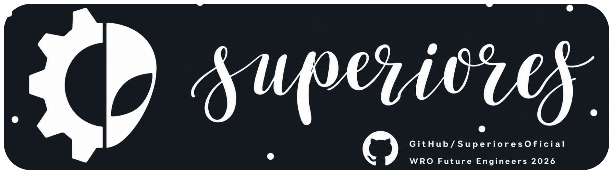

# WRO 2026 Future Engineers Superiores

  

##  Social Media

  
  &nbsp;&nbsp;&nbsp;
  
  &nbsp;&nbsp;&nbsp;
  

## Team Members

#### Team photo

  

<table align="center">
  <tr>
    <th colspan="2" align="left">
      Eduardo Alvarado González — Coach & Founder
    </th>
  </tr>
  <tr>
    <td width="260">
      
    </td>
    <td>
      <b>Age:</b> 40  
      I founded <b>Los Grises Superiores</b> in 2014 with the goal of creating a team where students could learn engineering through real competition experience. Over the years we have participated in multiple WRO and TMR events, reaching both national and international stages. This season I mainly support the team in project organization, technical guidance, and helping the students improve their engineering process during development.
    </td>
  </tr>
</table>

---

<table align="center">
  <tr>
    <th colspan="2" align="left">
      Christopher Pérez Cortés — Programming & Electronics
    </th>
  </tr>
  <tr>
    <td width="260">
      
    </td>
    <td>
      <b>Age:</b> 14  
      I joined the robotics club this year after taking an intensive robotics course, and since then I have been learning a lot about electronics, Arduino programming, and 3D design in Onshape. In the team I mainly work on the robot code, sensor integration, and electronics. WRO 2026 is my first international robotics competition, so this season has been a big learning experience for me.
    </td>
  </tr>
</table>

---

<table align="center">
  <tr>
    <th colspan="2" align="left">
      Bárbara Daiana García Balboa — Design & Assembly
    </th>
  </tr>
  <tr>
    <td width="260">
      
    </td>
    <td>
      <b>Age:</b> 13  
      I joined the robotics club a few months ago after completing two robotics courses. My main role in the team is helping with the mechanical design, chassis assembly, and testing different structural ideas for the robot. This is my first robotics competition, so I have been learning how the engineering and competition process works while building the project together as a team.
    </td>
  </tr>
</table>

##  Track Challenges

* **Open Challenge:** Complete 3 full laps of the track in the shortest time possible while maintaining lane alignment using sensors (distance and vision).
* **Obstacle Challenge:** Navigate the track and dodge colored pillars in real time using computer vision (camera):
  * **Red Pillars:** Dodge by passing on the right.
  * **Green Pillars:** Dodge by passing on the left.
* **Autonomous Parking:** Detect the designated parking space and perform an automatic parallel parking maneuver upon completion.

## Project Videos

The following videos show the vehicle driving autonomously during both WRO Future Engineers 2026 challenges. Additional video documentation is available in the [video/](video/) folder.

<table>
  <tr>
    <th>Open Challenge</th>
    <th>Obstacle Challenge</th>
  </tr>
  <tr>
    <td align="center">
      
    </td>
    <td align="center">
      
    </td>
  </tr>
  <tr>
    <td align="center">
      <a href="https://www.youtube.com/watch?v=diX7vBUeAKw">Watch on YouTube</a>
    </td>
    <td align="center">
      <a href="https://www.youtube.com/watch?v=LjnSCSj2Bsk">Watch on YouTube</a>
    </td>
  </tr>
</table>

