# WRO 2026 Future Engineers Superiores

  

##  Social Media

  
  &nbsp;&nbsp;&nbsp;
  
  &nbsp;&nbsp;&nbsp;
  

## Team Members

#### Team photo

  

<table align="center">
  <tr>
    <th colspan="2" align="left">
      Eduardo Alvarado González — Coach & Founder
    </th>
  </tr>
  <tr>
    <td width="260">
      
    </td>
    <td>
      <b>Age:</b> 40  
      I founded <b>Los Grises Superiores</b> in 2014 with the goal of creating a team where students could learn engineering through real competition experience. Over the years we have participated in multiple WRO and TMR events, reaching both national and international stages. This season I mainly support the team in project organization, technical guidance, and helping the students improve their engineering process during development.
    </td>
  </tr>
</table>

---

<table align="center">
  <tr>
    <th colspan="2" align="left">
      Christopher Pérez Cortés — Programming & Electronics
    </th>
  </tr>
  <tr>
    <td width="260">
      
    </td>
    <td>
      <b>Age:</b> 14  
      I joined the robotics club this year after taking an intensive robotics course, and since then I have been learning a lot about electronics, Arduino programming, and 3D design in Onshape. In the team I mainly work on the robot code, sensor integration, and electronics. WRO 2026 is my first international robotics competition, so this season has been a big learning experience for me.
    </td>
  </tr>
</table>

---

<table align="center">
  <tr>
    <th colspan="2" align="left">
      Bárbara Daiana García Balboa — Design & Assembly
    </th>
  </tr>
  <tr>
    <td width="260">
      
    </td>
    <td>
      <b>Age:</b> 13  
      I joined the robotics club a few months ago after completing two robotics courses. My main role in the team is helping with the mechanical design, chassis assembly, and testing different structural ideas for the robot. This is my first robotics competition, so I have been learning how the engineering and competition process works while building the project together as a team.
    </td>
  </tr>
</table>

##  Track Challenges

* **Open Challenge:** Complete 3 full laps of the track in the shortest time possible while maintaining lane alignment using sensors (distance and vision).
* **Obstacle Challenge:** Navigate the track and dodge colored pillars in real time using computer vision (camera):
  * **Red Pillars:** Dodge by passing on the right.
  * **Green Pillars:** Dodge by passing on the left.
* **Autonomous Parking:** Detect the designated parking space and perform an automatic parallel parking maneuver upon completion.

## Project Videos

The following videos show the vehicle driving autonomously during both WRO Future Engineers 2026 challenges. Additional video documentation is available in the [video/](video/) folder.

<table>
  <tr>
    <th>Open Challenge</th>
    <th>Obstacle Challenge</th>
  </tr>
  <tr>
    <td align="center">
      
    </td>
    <td align="center">
      
    </td>
  </tr>
  <tr>
    <td align="center">
      <a href="https://www.youtube.com/watch?v=diX7vBUeAKw">Watch on YouTube</a>
    </td>
    <td align="center">
      <a href="https://www.youtube.com/watch?v=LjnSCSj2Bsk">Watch on YouTube</a>
    </td>
  </tr>
</table>

## Project Overview & Abstract

This project was developed as the evolution of our 2025 WRO Future Engineers robot, which successfully reached the international final. Based on the experience gained during that season, the entire vehicle was redesigned for 2026 using a fully 3D-printed chassis, an OpenMV H7 camera, and an Arduino Nano-based control system to improve stability, adaptability, and overall performance.

The robot was built to autonomously complete the two Future Engineers challenges established by the WRO 2026 rules. During the Open Challenge, the vehicle must complete three laps while adapting to randomized track conditions such as driving direction, starting position, and corridor width. In the Obstacle Challenge, the robot must detect colored traffic pillars, avoid them from the correct side, and finally perform a parallel parking maneuver inside the designated parking zone.

Throughout the development process, the team continuously tested and improved both the mechanical and software systems in order to adapt the robot to the new 2026 rule changes and achieve more reliable autonomous behavior.

### Chassis Design & Iteration 

Our first robot designs were based on a LEGO Mindstorms EV3 chassis. While it was easy to build and modify, we noticed several limitations during testing, especially related to weight, space distribution, and steering precision. The EV3 structure was also too restrictive for the type of custom design we wanted to achieve for the 2026 season.

Because of this, we decided to redesign the entire chassis using fully 3D-printed parts designed in Onshape. Our main goal was to create a lighter and more compact structure while still following the WRO size and weight regulations. We also wanted to improve stability, steering performance, and sensor placement.

Throughout the season, we tested different chassis versions. The first prototype used a flat structure, but during steering tests we discovered that the chassis flexed when the servo applied force, causing inaccurate steering movements. To improve rigidity, we redesigned the structure by adding reinforced supports and increasing the wall thickness in critical areas.

Later, we developed a third version focused on improving cornering performance in the new 600 mm corridor introduced in the 2026 rules. We reduced the overall length of the robot and relocated some electronic components to lower the center of gravity and improve balance while turning.

During the final reprint of the chassis using grey PLA filament, we encountered an unexpected problem: the drivetrain became stuck even though the motor was working correctly. After inspecting the structure, we realized that the new filament produced slightly tighter tolerances, causing friction around the rear axle housing. To solve this, we manually sanded the affected area until the shaft rotated smoothly again. After this issue, we started checking all moving parts after every print before assembling the robot.

### Steering System

The robot uses an **Ackermann steering geometry** controlled by a rack-and-pinion mechanism. The steering system was developed through several iterations during the prototyping process.

In the previous prototype, we used a **Steren MOT-110 micro servo** to control the steering mechanism. This version allowed us to test the basic steering geometry and evaluate the mechanical response of the system.

For the final vehicle, we decided to use an **SG90 micro servo**. The SG90 was selected for the final version because it provided the required steering movement while being compact and easy to integrate into the redesigned chassis.

The servo is connected to a **LEGO Technic rack-and-pinion mechanism (part 64781)**, which converts the servo's rotational movement into the linear movement required to turn the front wheels.

The steering system follows **Ackermann geometry**, allowing the inner and outer front wheels to turn at different angles during a corner. This helps the vehicle maintain a more appropriate trajectory while navigating the track.

The final steering configuration consists of:

* **Servo motor:** SG90 micro servo
* **Steering mechanism:** Rack-and-pinion
* **Rack:** LEGO Technic part 64781
* **Steering geometry:** Ackermann
* **Control:** Arduino Nano

 ## Robot Photos

| Front | Back | Left |
|:---:|:---:|:---:|
|  |  |  |

| Right | Top | Bottom |
|:---:|:---:|:---:|
|  |  |  |

- Robot Weight: 0.710 kg

## Robot 360º

  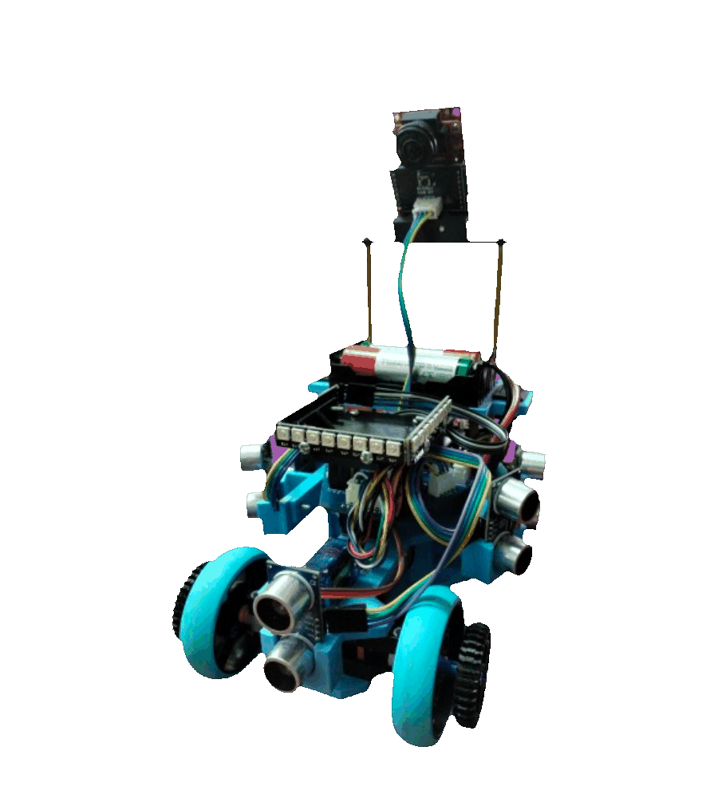

  
## Robot Components

| Component | Quantity | Main Function |
|---|:---:|---|
| ESP32 Microcontroller | 1 | Main processing / communication with OpenMV and sensors |
| Arduino Nano Microcontroller | 1 | Additional control (motor, encoders, ultrasonic sensors) |
| OpenMV Camera | 1 | Color vision, RX/TX communication (UART) |
| BNO085 IMU | 1 | Orientation / yaw (I2C: SCL, SDA) |
| HC-SR04 Ultrasonic Sensor | 5 | Distance measurement (front, 2 left, 2 right) |
| TB6612FNG Motor Driver | 1 | H-bridge for controlling the DC motor (PWMA, AIN1, AIN2, STBY) |
| DC Motor with Encoder | 1 | Traction (uses ENC_A and ENC_B for speed feedback) |
| 4-Channel Logic Level Converter | 1 | Adapts 3.3V ↔ 5V signals between modules (HV/LV x4) |
| Steering Servo | 1 | Steering control (S1 signal, SER_5+ power supply) |
| NeoPixel LEDs (WS2812) | 1 strip | Indicator lighting / vision assistance |
| 18650 Battery | Several | Main power supply (power bank) |
| Mini-560 Buck Converter | 2 | Voltage regulation (one line to 5V, another to 3.3V) |
| 7805 Voltage Regulator | 2 | One for the servo (SER_5+), another for the LEDs (LEDS_5+) |
| Digital Voltmeter | 1 | Battery voltage monitoring |

## Code

Our robot uses two main programs that work together. The Arduino Nano handles the distance sensors and LED strips, while the ESP32 acts as the main controller of the robot.

### Arduino Nano — Sensors & LEDs

The Arduino Nano works as an assistant to the ESP32. It measures the five ultrasonic sensors, controls three strips of eight LEDs, and communicates the sensor measurements to the ESP32 through I2C.

**Main functions:**

* Reads five ultrasonic distance sensors.
* Controls 24 LEDs arranged in three strips of eight.
* Sends distance measurements to the ESP32.
* Receives the LED intensity level from the ESP32.
* Uses I2C communication at address `0x08`.

[View Arduino Nano Code](./codes/Nano_Sensores_I2C_3x8.ino)

### ESP32 — Main Robot Control

The ESP32 is the main controller of the robot. It receives the distance measurements from the Arduino Nano and uses them to control the motor, steering, speed, safety systems, lap counting, and final parking sequence.

**Main functions:**

* Receives data from the five distance sensors.
* Controls the DC motor through the TB6612FNG.
* Controls the SG90 steering servo.
* Uses the BNO085 to track orientation and count three laps.
* Uses the encoder to detect actual wheel movement.
* Maintains the robot centered using PID control.
* Detects walls and corners.
* Adjusts speed according to track conditions.
* Performs emergency reverse maneuvers.
* Executes the final movement after completing three laps.
* Provides an optional Wi-Fi dashboard for monitoring the robot.

[View ESP32 Code](./codes/ESP32_Open_Optimizado.ino)

# LEGO Set Use

| BLItemNo | ElementId | LdrawId | Part Name | BLColorId | LDrawColorId | Color Name | Qty | Weight (g) | Price per piece (USD) | Total (USD) |
|----------|------------|----------|------------|------------|----------------|-------------|-----|--------------|-------------------------|---------------|
| 6589 | 4565452 | 6589.dat | Technic Gear 12 Tooth Bevel | 19 | 19 | Tan | 3 | 0.40 | 0.15 | 0.45 |
| 3713 | 6275844 | 3713.dat | Technic Bush | 86 | 7 | Light Bluish Gray | 6 | 0.20 | 0.05 | 0.30 |
| 32523 | 4142822 | 32523.dat | Technic Liftarm 1 x 3 | 11 | 0 | Black | 2 | 0.80 | 0.20 | 0.40 |
| 39367pb01 | 6460453 | 39367.dat | Wheel 56 x 14 Technic | 102 | 9 | Blue | 4 | 5.50 | 1.50 | 6.00 |
| 62821b | — | 62821.dat | Technic Differential Gear (Closed) | 85 | 8 | Dark Bluish Gray | 1 | 3.50 | 3.50 | 3.50 |
| 87083 | 6083620 | 87083.dat | Technic Axle 4L with Stop | 85 | 8 | Dark Bluish Gray | 4 | 0.60 | 0.10 | 0.40 |
| 94925 | 4640536 | 94925.dat | Technic Gear 16 Tooth | 86 | 7 | Light Bluish Gray | 4 | 0.50 | 0.20 | 0.80 |
| 43093 | — | 43093.dat | Technic Axle 1L with Pin | 102 | 9 | Blue | 2 | 0.30 | 0.15 | 0.30 |
| 43093 | — | 43093.dat | Technic Axle 1L with Pin | 19 | 19 | Tan | 2 | 0.30 | 0.15 | 0.30 |
| 48989 | 6282158 | 48989.dat | Technic Pin Connector Perpendicular 3L | 86 | 7 | Light Bluish Gray | 2 | 1.00 | 0.30 | 0.60 |
| 40490 | 4645732 | 40490.dat | Technic Liftarm 1 x 9 | 15 | 15 | White | 1 | 1.20 | 0.50 | 0.50 |
| 32523 | 4142822 | 32523.dat | Technic Liftarm 1 x 3 | 11 | 0 | Black | 2 | 0.80 | 0.20 | 0.40 |
| 4265c | 6271167 | 4265c.dat | Technic Bush 1/2 Smooth | 3 | 14 | Yellow | 2 | 0.10 | 0.10 | 0.20 |

| TOTAL PARTS | TOTAL WEIGHT |
|--------------|----------------|
| 35 | 39.2 g |

### Traction System

For the traction system, we decided to use a rear-wheel drive configuration powered by a DC motor with an integrated gearbox connected to a TB6612FNG motor driver. Both rear wheels are connected through the same drivetrain, which helped us keep the system simpler, lighter, and fully compliant with the WRO rules.

During testing, we experimented with different gear ratios to find the best balance between speed and control. Some configurations made the robot extremely fast, but that also reduced the reaction time when detecting obstacles or correcting direction. Other configurations improved stability but made the robot too slow during acceleration.

After multiple test sessions, we found that an approximate 1:30 gear ratio gave us the best overall performance for both challenges.

| Parameter | Value |
|---|---|
| Drive motor | DC motor with gearbox |
| Motor driver | TB6612FNG dual H-bridge |
| Drive system | Rear-wheel drive |
| Wheel configuration | Both rear wheels connected together |
| Selected gear ratio | Approx. 1:30 |

### Speed Testing

| PWM Value | Approx. Speed | Main Use |
|---|---|---|
| 110 | ~0.28 m/s | Narrow corridor and obstacle sections |
| 130 | ~0.36 m/s | Normal track navigation |
| 150 | ~0.44 m/s | Open straight sections |

### Gear Ratio Comparison

| Gear Ratio | What Happened |
|---|---|
| 1:20 | The robot became too fast and reacted late to obstacles |
| 1:50 | Acceleration became too slow for completing laps efficiently |
| 1:30 | Best balance between speed, control, and stability |

#### Mechanical Trade-offs & Decisions

During the development process, we tested different ideas and components before deciding on the final configuration of the robot. In several cases, we had to choose between simplicity, performance, reliability, and compliance with the WRO rules.

| System | Option We Chose | Option We Rejected | Why We Chose It |
|---|---|---|---|
| Chassis material | 3D-printed PLA | LEGO Technic | Allowed us to create custom shapes while reducing overall weight |
| Steering system | Servo + rack mechanism | Differential steering | More stable and compliant with WRO steering rules |
| Drive system | Single DC motor | Two coupled motors | Simpler wiring, lighter structure, and easier control |
| Vision system | OpenMV H7 (UART) | HuskyLens (I2C) | OpenMV provided faster and more stable data during movement |

One of the most important decisions was replacing the HuskyLens camera with the OpenMV H7. During testing, we noticed that the HuskyLens sometimes sent data too slowly, which caused unstable steering corrections and servo oscillation. After switching back to the OpenMV system, the robot behaved much more smoothly and consistently during autonomous navigation.**

####  Structural Components (3D Design) 

| Central Sensor Mount | Side Sensor Mounts | Rear Support |
|:--:|:--:|:--:|
| 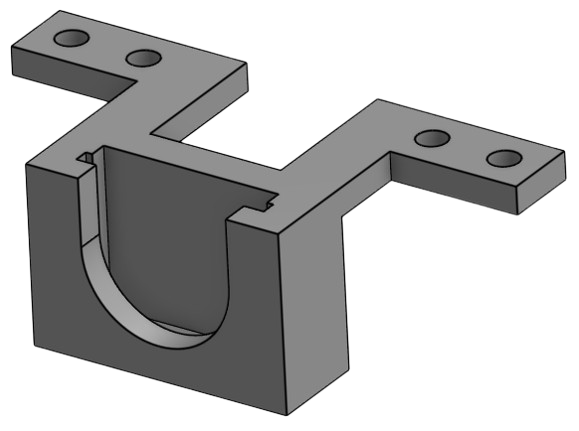 | 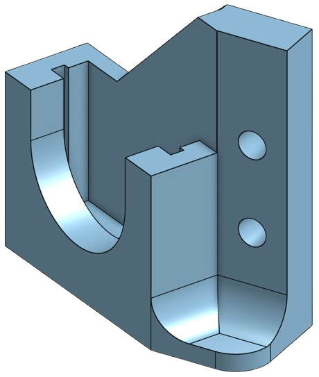 | 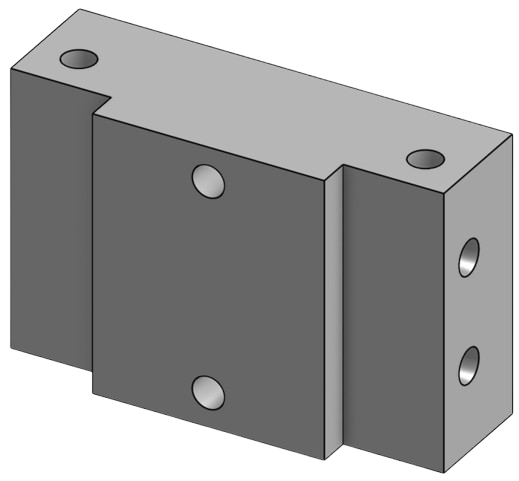 |

| External Supports | Internal Supports | Directional Module |
|:--:|:--:|:--:|
| 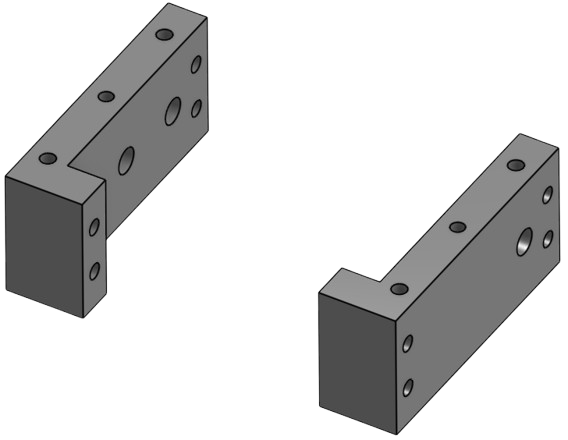 | 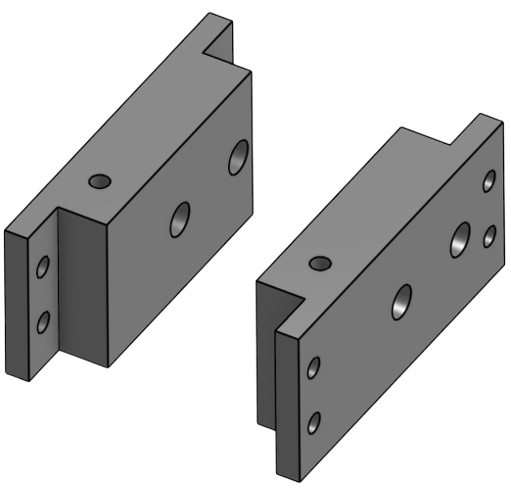 | 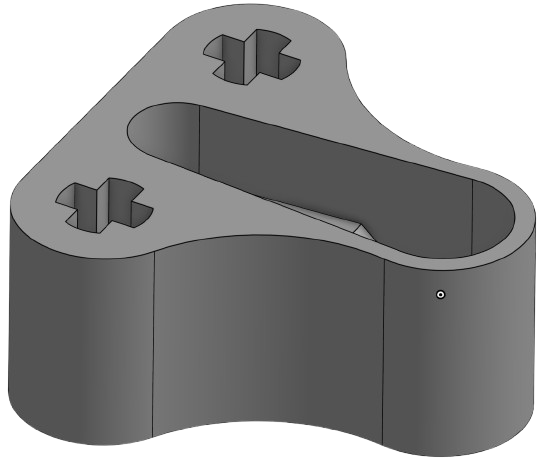 |

| Lower Body | Upper Body | Full Base Structure |
|:--:|:--:|:--:|
| 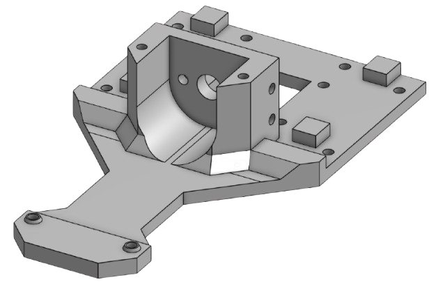 | 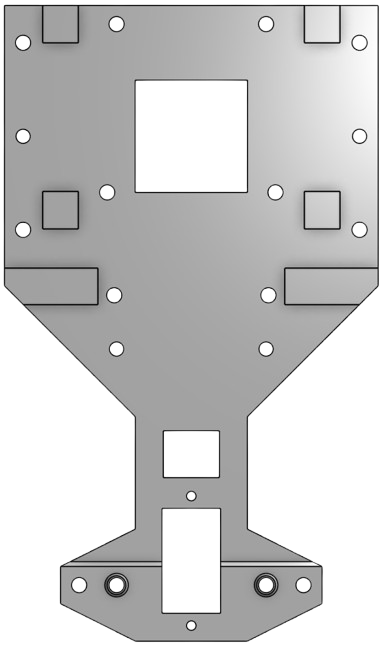 | 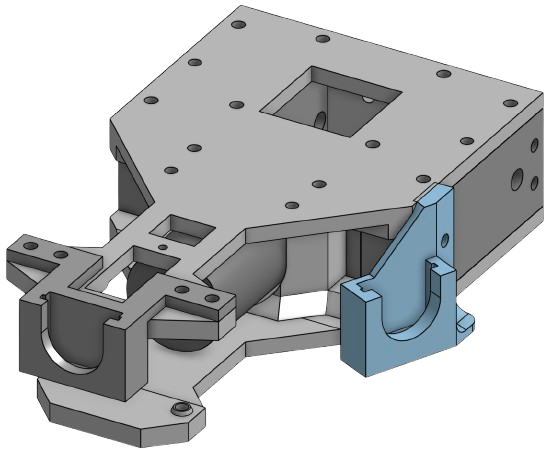 |

---

| Main Switch | 1 | Motor / system power cutoff |
| 2P Terminal Block | 1 | Power input (7.4V+) |

####  Main Chassis Structure

| Lower Body | Upper Body |
|:--:|:--:|
|  |  |

---

####  Complete Aseembly

| Full Base Structure |
|:--:|
|  |

---

####  Steering Component

| Directional Module |
|:--:|
|  |

---

## PCB & Wiring Implementation

<table>
  <tr>
    <td align="center" width="50%">
      <strong>PCB Design</strong>  
      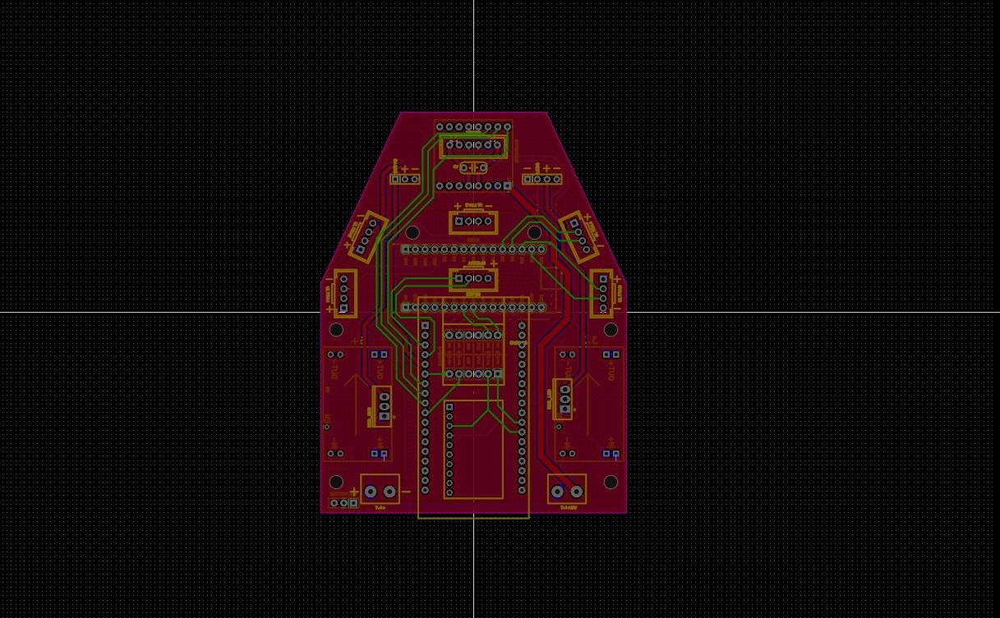
    </td>
    <td align="center" width="50%">
      <strong>Real PCB</strong>  
      
    </td>
  </tr>
  <tr>
    <td colspan="2" align="center">
      <strong>PCB Schematic</strong>  
      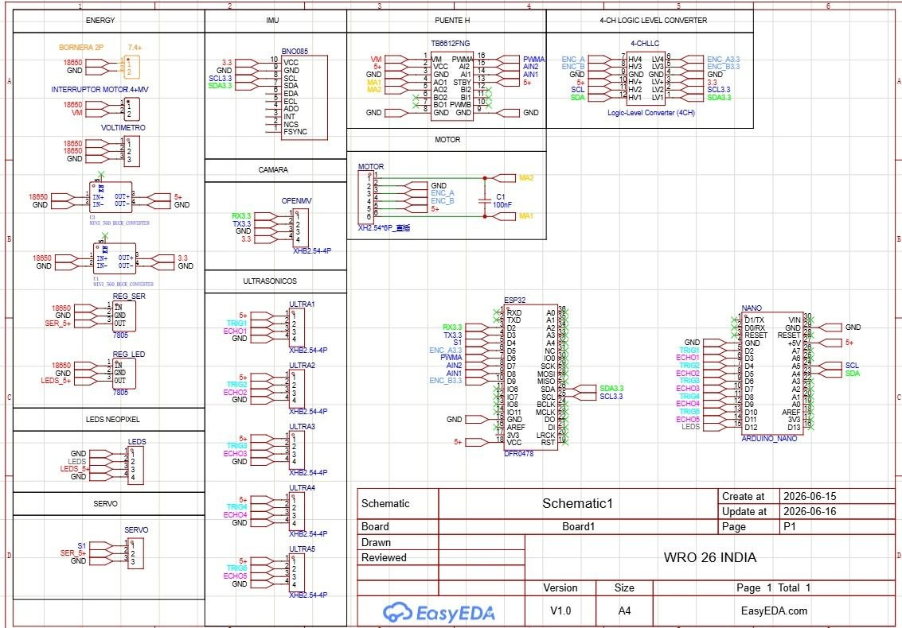
    </td>
  </tr>
</table>
